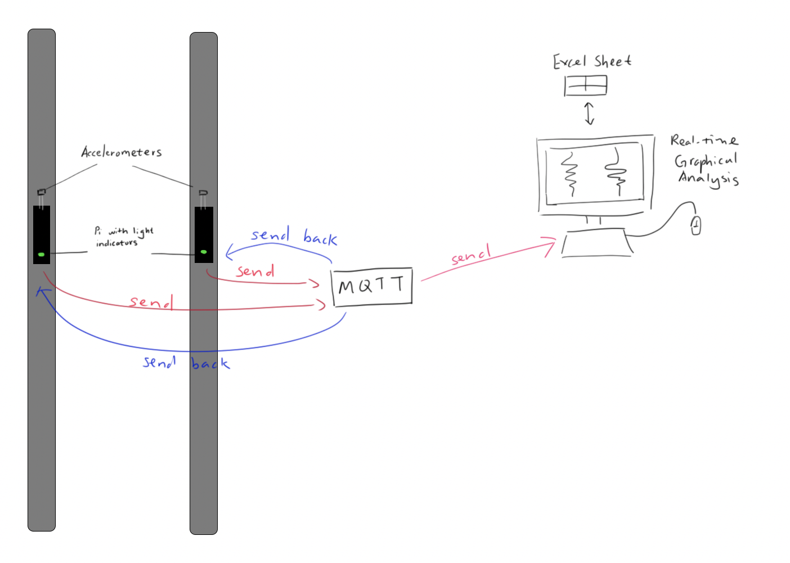
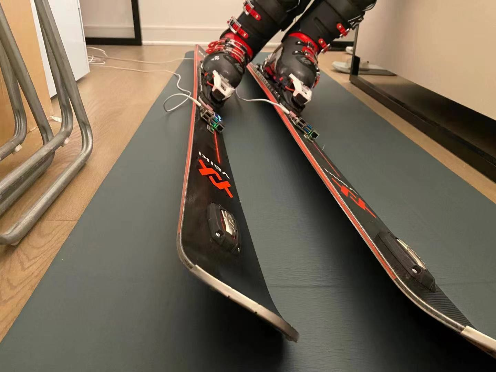
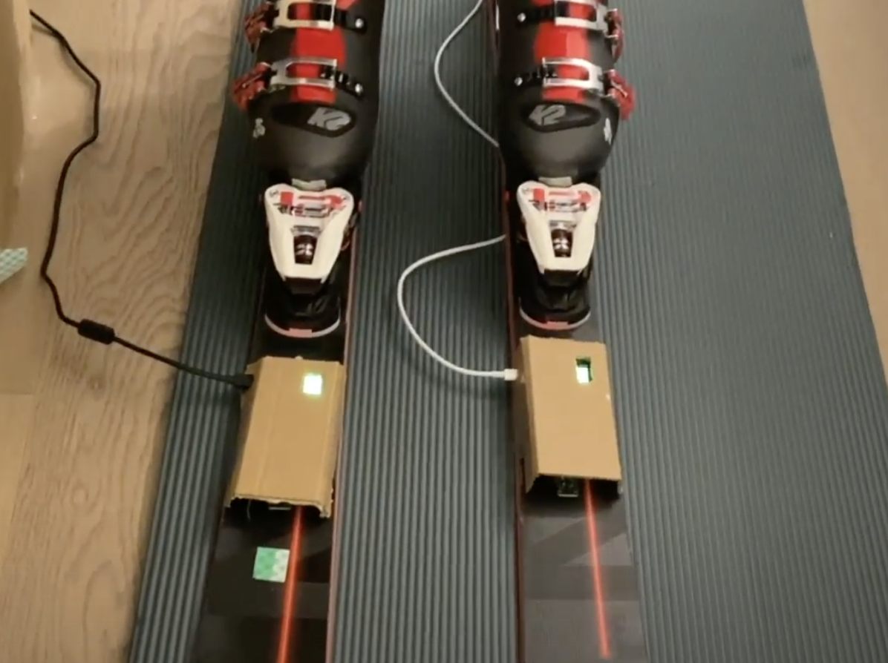
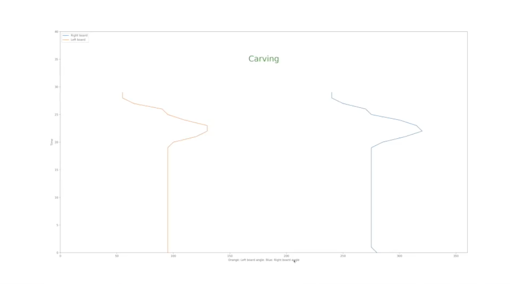

# Final Project

## Objective

The goal of final project is to design and develop an interactive device that could be used to better train skiers the carving technique -- meaning that both of the skies should have the same angle and parallel positions to ensure speed. At the current moment, the most mainstream method for skiers to monitor their carving is by having someone else to ski after and record video. By creating this device, we propose a more convenient and interactive solution that allows real-time monitoring.

## Description
Overall, users should be able to turn on the device during skiing, and they would be informed on whether they are carving or not. The device would allow real-time monitoring and provide live-feedback.

## Deliverables

1. Documentation of design process
2. Archive of all code, design patterns, etc. used in the final design. (As with labs, the standard should be that the documentation would allow you to recreate your project if you woke up with amnesia.)

The ideation process started with finding an idea that is attainable while also being useful in some ways. Carving is a technique that is required for advanced skiers. However, intermediate skiers often make mistakes when carving, not realizing that their boards are not parallel. Therefore, we want the system to both inform the skiier their carving status while reporting to a coach remotely in manners that are easy to understand and analyze. Some of the main challenges we faced are: how to make the pi receive and send data in the same time, what data to measure using the accelerometers, and how to present the collected data in a graphical format. 



As seen in the diagram, the main parts that perform the functionalities of the device are the following:

1. Two Raspberry Pis
2. Two Accelerometers
3. A computer 

We start by placing the two accelerometers on both of the skiis. Each accelerometer is getting the angle of the skies. The angle data and the timestamp is then sent via MQTT to the desktop backend. The desktop program will parse the data recieved, automatically merge angles from two Pis, and then save them all in a CSV file. The data visualization program will take the angle data and plot them on the graph. If the delta of two angles are greater than 10 degrees, the program will determine that the user is not carving and then send that information back to the Pis via MQTT.




From the technical aspect, the project focuses on the communication using the MQTT protocol to transfer data. The system takes in the data real-time, then determining whether the skiier is carving or not. If the skiier is carving correctly, the lights would be green, and if the skiier is not carving properly, the lights would shine red instead.




Since we want to have a real-time graphical display, allowing someone like a training coach to view the carving status remotely. We utilized matplotlib's animation class to acheive the real-time plotting, repeatly calling the plotting function using FuncAnimation.




## Video
https://drive.google.com/file/d/1h3ePDPEj6DfpaxpS3JtX8lq7xh7sKwb6/view?usp=sharing

### Installation

1. Clone the repo on two Pis and desktop
   ```sh
   git clone https://github.com/jiadonglou/Interactive-Lab-Hub
   ```
2. Change Directory to Final Project
   ```sh
   cd 'Final Project'
   ```
3. Install all dependancies
   ```sh
   pip install -r requirements.txt
   ```
   
4. Run program on both of your Skiis
   ```sh
   python skileft.py
   ```
   or
   ```sh
   python skiright.py
   ```

5. Run program on your desktop
   ```sh
   python reader.py
   python visualization.py
   ```

## Reflection
Overall, we are pretty satisfied with the progress of the project -- we are able to implement most of the functionalities that are planned. It is also worthy to note that we are suprised by the sheer amount of resources available online -- a lot of the seemingly difficult tasks (like having the pi to receive and send data on the same time) are much easier than we expected due to the sheer amount of tutorial and resources we can find. 

During our presentation, someone brought up that the device would need to be water-proof due to the snowy environment it would be used in. It is interesting that none of us have thought about this point at all. Sometimes it is easy to ignore very basic consideration.

## Teams

Members:
Jiadong Lou (jl3937) \
Chelsea Luo (cl773)

The project is done in a two people group, with work evenly divided. The project is completed with both team members sitting in the same room, thus both of the members have worked on both the coding, building, and design process of the project. 

